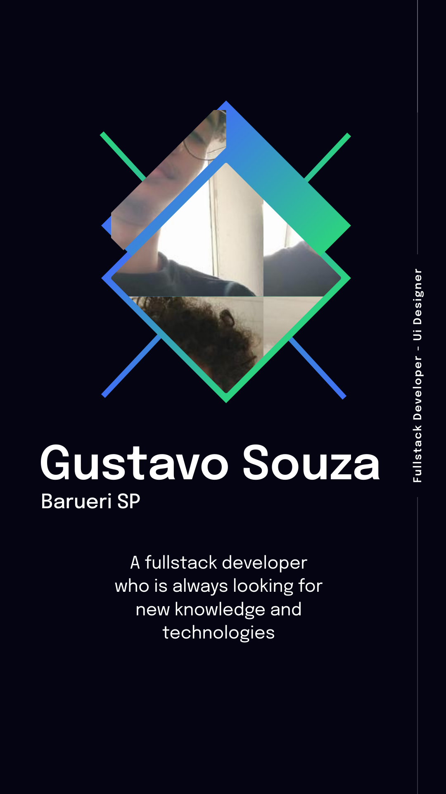

<!--  -->
<h1 align="left">Hi, I'm Gustavo Souza</h1>

  

- 🔥 Fullstack Developer and UI Designer
- 🌱 Currently studying Flutter
- 🔭 Working on my portfolio
- 🥅 2022 Goals: Contribute more to Open Source projects
- ⚡ Fun fact: I love to draw and learn new things

 

## 🛠 &nbsp;Tech Stack

&nbsp;
&nbsp;
&nbsp;
&nbsp;
&nbsp;
&nbsp;
&nbsp;
&nbsp;
&nbsp;
&nbsp;
&nbsp;
&nbsp;
&nbsp;
&nbsp;
&nbsp;

 

<!-- ## ⚙️ &nbsp;GitHub Analytics

  -->
